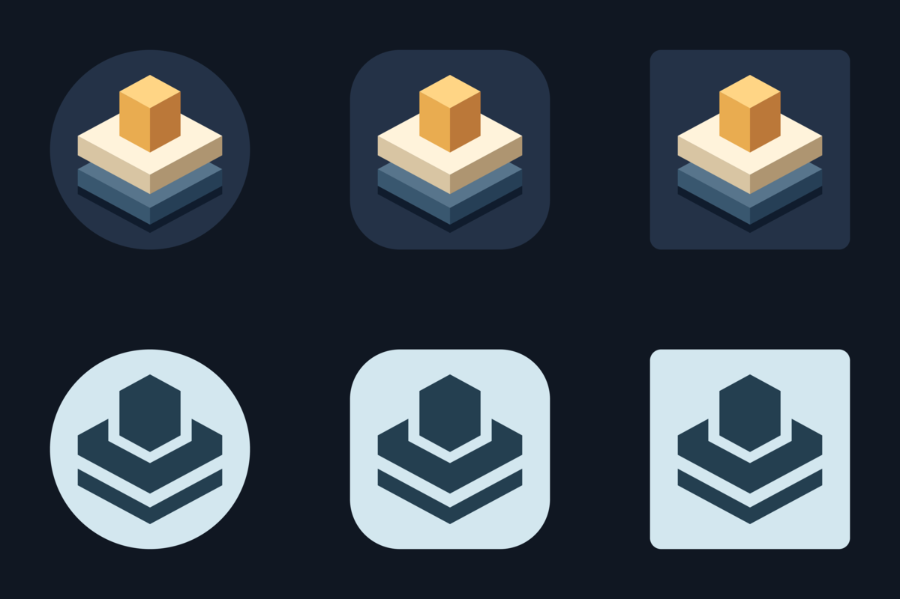

# Gotak Android icon

An amber capstone over ivory and slate Tak stones, drawn in the same isometric perspective as the game board. Background: `#243247`.



## Assets

- `foreground.svg` and `monochrome.svg`: editable 108 × 108 adaptive-layer sources, with the artwork inside the central 66dp safe circle.
- `../adaptive-icon.png`: transparent 1024 × 1024 foreground, including adaptive padding.
- `monochrome.png`: transparent 1024 × 1024 themed layer; gaps keep the stones distinct when Android applies a single tint.
- `../icon.png`: 1024 × 1024 full-bleed app icon.
- `icon.svg`: editable full-bleed composition.
- `play-store.png`: 512 × 512 RGBA, opaque, square Google Play listing icon, without baked-in corner rounding.
- `preview.png`: circle, rounded-square, and square crops in color and an example wallpaper tint.

`app.json` configures the foreground, background color, and monochrome image. Expo generates all native density variants and adaptive XML; `android/` is gitignored.

## Regenerate

Install ImageMagick 7 and `@resvg/resvg-js-cli` (the `magick` and `resvg-js` commands must be on `PATH`), then run:

```sh
python3 assets/android-icon/generate.py
npx expo prebuild --platform android --no-install
```

Rebuild the app to update the installed launcher icon. Android 13+ launchers use the monochrome image when themed icons are enabled.
